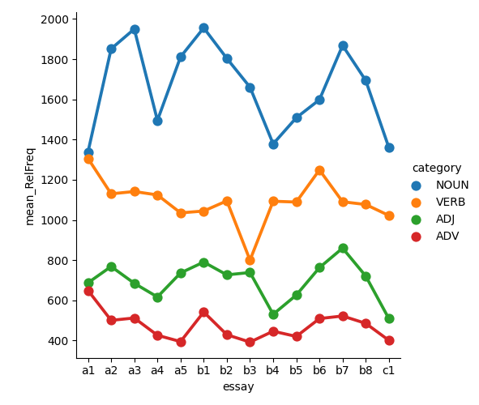

[](https://classroom.github.com/online_ide?assignment_repo_id=10145323&assignment_repo_type=AssignmentRepo)

# Extracting linguistic features using spaCy

This repository contains script which uses ```spaCy``` to extract linguistic information from a corpus of texts. Feature extraction is a NLP method where a model (like spaCy) devides a text into individual tokens. It is then able to peform part of speech tagging which is when it recognizes the tokens grammatical class (noun, adjective, verb etc.). 

The data that will be analyzed is *The Uppsala Student English Corpus (USE)* which consists of 1,489 essays written by 440 Swedish university students of English at three different levels. There is more information available documentation via [this link](https://ota.bodleian.ox.ac.uk/repository/xmlui/handle/20.500.12024/2457).

The code in this repository does the following:
- Loops over each text file in the folder called ```in```
- Extracts the following information:
    - Relative frequency of Nouns, Verbs, Adjective, and Adverbs per 10,000 words
    - Total number of *unique* PER, LOC, ORGS
- For each sub-folder (a1, a2, a3, ...) saves a table which shows the following information:

|Filename|RelFreq NOUN|RelFreq VERB|RelFreq ADJ|RelFreq ADV|Unique PER|Unique LOC|Unique ORG|
|---|---|---|---|---|---|---|---|
|file1.txt|---|---|---|---|---|---|---|
|file2.txt|---|---|---|---|---|---|---|
|etc|---|---|---|---|---|---|---|

- **```additional task```** Makes two visualizations:
1. One showing the development of mean relative frequency for each category (e.g. the average relative frequency for all a1-essays). 
2. One showing the mean number of *unique* PER, LOC, ORGS per essay.


## User instructions

1. install necessary packages using the setup script like so:

```bash setup.sh```

2. Run the scripts using the run script:

```bash run.sh```

## Discussion



The results of the feature extraction is not what I initially anticipated. I had expected that the distribution of word classes would have developed in a more clear way as the students progressed through the levels. Specifically, I assumed that the mean relative frequency of adverbs or adjectives might have gone up.

The visualization below shows the average mentions for persons, locations and organisations across the essays:


As shown, the number of named entities varies from essay to essay (probably due to the topic of the individual essay also). "PER" is the category with the most unique mentions. 

Overall, I think SpaCy can be useful for both teachers as well as linguists. It could also be used to explore the differences between texts of different genres or time periods. 
